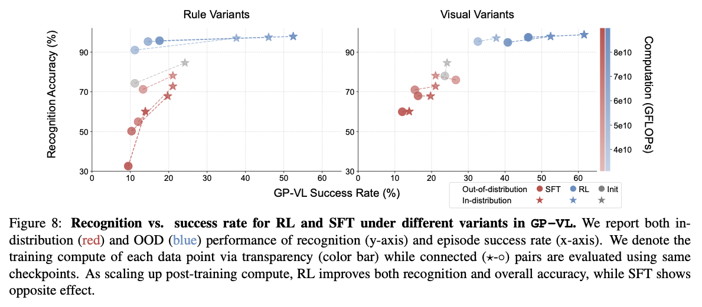
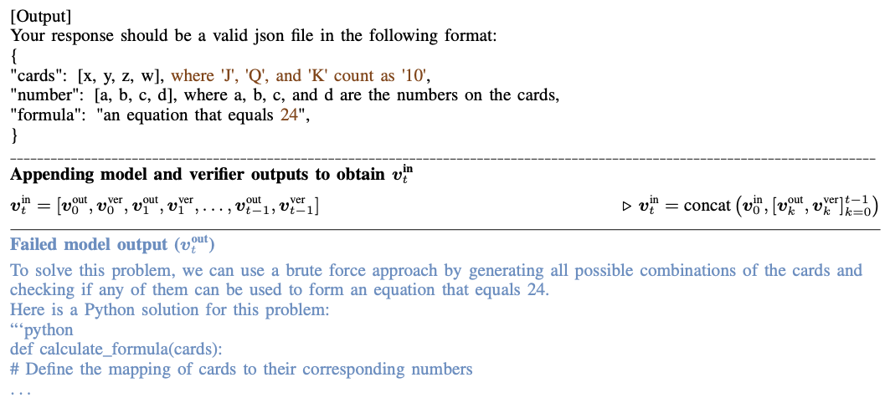

:::{.callout-note}
- Article: [*SFT Memorizes, RL Generalizes: A Comparative Study of Foundation Model Post-training*](https://arxiv.org/pdf/2501.17161)
- Presenter: [Hongsup Shin](https://www.linkedin.com/in/hongsupshin/)
- Attendees: [Anil Kamat](https://www.linkedin.com/in/anil-kamat-6383a314b/), [Chunshan Liu](https://www.linkedin.com/in/chunshan-liu-5b832b104/), [Eric Abelson](https://www.linkedin.com/in/ericabelson), [Satish K C](https://www.linkedin.com/in/satishkc7/)
:::

## Why this paper

The question of whether LLMs can actually reason has become increasingly contentious. Modern post-training pipelines commonly stack different paradigms:

- **SFT**: "Learn from demonstrations" via cross-entropy on next tokens
- **DPO**: "Prefer this over that" via binary classification on log-probability ratios
- **PPO**: "Optimize for outcomes" via policy gradients

However, train and test distributions are often very similar. In large models, this makes it difficult to determine whether performance gains come from learning transferable rules or simply memorizing solution patterns. Critically, *memorization and performance can improve at the same time*, especially in large models.

This paper addresses a fundamental question: *Good performance ≠ good reasoning.* As practitioners, we often observe that models achieve impressive benchmark scores while failing on slight variations of the same problem. The authors tackle this by designing experiments that deliberately expose whether models have learned generalizable rules or merely memorized surface forms. The experimental philosophy is intentionally strict: *make the rule change as small as possible, then see if the model breaks*.

The paper is particularly timely given recent developments like DeepSeek-R1 and OpenAI's o1, which heavily emphasize RL-based training. Understanding when and why RL outperforms SFT has direct implications for how we should approach post-training in production systems.

## Paper summary

The authors compare SFT and RL on two tasks designed to test generalization: `GeneralPoints`, an arithmetic card game, and `V-IRL`, a real-world navigation environment. Both tasks have rule-based and visual variants, allowing systematic evaluation of out-of-distribution (OOD) performance.

### Behavioral vs. storage-level memorization

An important conceptual distinction in this paper is between *behavioral memorization* and *storage-level memorization*:

- **Behavioral memorization**: Near-identical outputs or solution traces. Brittle behavior under rule or input changes. This is what the paper studies.
- **Storage-level memorization**: Literal storage of training data in model weights. Bitwise or near-verbatim reproduction. Typically studied in privacy or model-extraction attacks.

The authors focus on the *behavioral memorization*. This framing is useful because it shifts the conversation from "did the model see this exact example?" to "did the model learn the underlying rule?"

### Experimental setup

The paper uses Llama-3.2-Vision-11B as the backbone model. Following standard post-training pipelines, they initialize the model with SFT before running RL. The key innovation (used in the past by one of the authors) is the **multi-step RL with verification** framework:

1. Model produces an answer
2. A verifier evaluates the output
3. Feedback is appended to the prompt
4. Model revises its answer
5. Repeat for N steps

This is not single-shot RLHF. It's a sequential revision formulation that allows the model to learn from its mistakes during both training and inference, and all the revisions are concatenated and used in the next training step. The RL used in the paper uses PPO (on-policy training), and their appendix describes how much compute has been used for RL, which includes compute for the replay buffer, which acts like short-term memory. Finally, the paper finds that outcome-based rewards plus verification work, consistent with prior work by Cobbe et al.

### Key findings

**RL generalizes, SFT memorizes.** Across all settings (except for one (see below)), RL consistently improves OOD performance while SFT degrades, often dramatically. Even when SFT achieves strong in-distribution performance, it collapses under rule or visual shifts. In contrast, RL shows smoother, more monotonic improvements as compute and inference-time reasoning increase. Inference-time reasoning actually makes SFT OOD performance much worse, similar to how model overfitting manifests. The pattern holds for both text-only and vision-language tasks.



**RL improves visual recognition as a byproduct.** In the vision-language setting (GP-VL), scaling RL compute improved both task success and *visual recognition accuracy*. SFT showed the opposite effect. Scaling up training actually degraded visual recognition capabilities. This emergent improvement in visual understanding, achieved without explicit visual supervision, is one of the paper's strongest (and possibly the most interesting) arguments for RL as a capability-learning mechanism, not just an alignment tool. Prior SFT-based fixes have included multiple encoders with different architectures/resolutions, heavy data curation, unfreezing visual encoders during SFT, and so on. These approaches are expensive and often lead to overfitting. RL, by contrast, improves visual recognition, task success, and OOD robustness without explicit visual supervision, suggesting that task-level feedback can shape perception indirectly in VLMs. Their multi-turn RL approach also achieved state-of-the-art on the V-IRL VLN mini benchmark, significantly outperforming the previous best which relied on a two-stage VLM-LLM collaboration with GPT-4.



**SFT is necessary but not sufficient.** Without SFT initialization, RL fails because the base model doesn't follow instructions well enough to generate usable rewards. RL collapses due to unusable reward signals. However, RL cannot rescue overfitted SFT checkpoints. This leads to one of the most interesting open questions: *"Is RL powerful enough to rescue an overfitted model?"* Apparently not. SFT is best viewed as a format stabilizer, not a capability learner.

**Inference-time compute matters.** More verification steps lead to better generalization. RL generalizes substantially better with more verification iterations, while single-step verification shows only marginal OOD improvement. The authors do not disclose the qualitative nature of the longer reasoning traces, but we can assume that they include the following: chain-of-thought, search and branching, self-evaluation, iterative refinement, re-ranking, etc. Importantly, in alignment with recent research, the paper suggests that reasoning may happen before token emission, not just as visible chain-of-thought.

## Discussion

The experimental design is clean and the core insight is valuable. By using minimal rule changes, the authors create a rigorous test of whether models truly learn rules or memorize surface forms. The finding that RL improves visual recognition as an emergent byproduct of task optimization is particularly compelling and has practical implications for multimodal systems. We also appreciated that the authors thoroughly investigated SFT hyperparameters to explain the SFT failure on GP-VL. Rather than dismissing it as an anomaly, they ran extensive ablations across different learning rates and tunable components, which strengthens their conclusion that SFT's poor performance is fundamental rather than a tuning issue.

### Limitations and open questions

**SFT failure on GP-VL deserved deeper investigation.** The authors acknowledge that SFT fails to achieve comparable in-distribution performance with RL on the vision-language variant of GeneralPoints (Fig.1: row 1, column 3), even after extensive hyperparameter tuning. Their hypothesis is that SFT overfits to reasoning tokens while neglecting recognition tokens due to frequency imbalance. This is plausible, but beyond tuning hyperparameters, they didn't do much to actually verify this hypothesis. We wish they had done more to understand *why* this happens. This is unfortunately a common pattern in AI research papers. The discussion section is brief, mechanistic explanations remain speculative, and everything is punted to "future work."

**Task complexity concerns.** We questioned whether the chosen tasks are complex enough to support broad claims about reasoning. In GeneralPoints, the "visual recognition" challenge is simply reading printed numbers on cards, not actual counting or visual reasoning. The arithmetic itself is straightforward once the numbers are identified. Similarly, V-IRL navigation follows explicit turn-by-turn instructions rather than requiring spatial planning or inference. Both tasks have deterministic rules and clear-cut success criteria. While this makes the experiments clean, it's unclear whether findings generalize to tasks requiring genuine multi-step reasoning, ambiguous inputs, or compositional generalization.

**Model scale and architecture.** The experiments use Llama-3.2-Vision-11B, a relatively large model, but it's unclear how results would change with smaller or differently architected models. Smaller models might struggle more with SFT due to limited capacity, potentially exaggerating the observed differences. Conversely, larger models might mitigate some SFT issues through sheer capacity. Testing across a range of model sizes would strengthen the conclusions.

---

*If you found this post useful, you can cite it as:*

```bibtex
@article{
    austinmljc-2026-sft-rl,
    author = {Hongsup Shin},
    title = {SFT Memorizes, RL Generalizes: A Comparative Study of Foundation Model Post-training},
    year = {2026},
    month = {01},
    day = {29},
    howpublished = {\url{https://austinmljournalclub.github.io}},
    journal = {Austin ML Journal Club},
    url = {https://austinmljournalclub.github.io/posts/20260129-sft-rl/},
}
```
