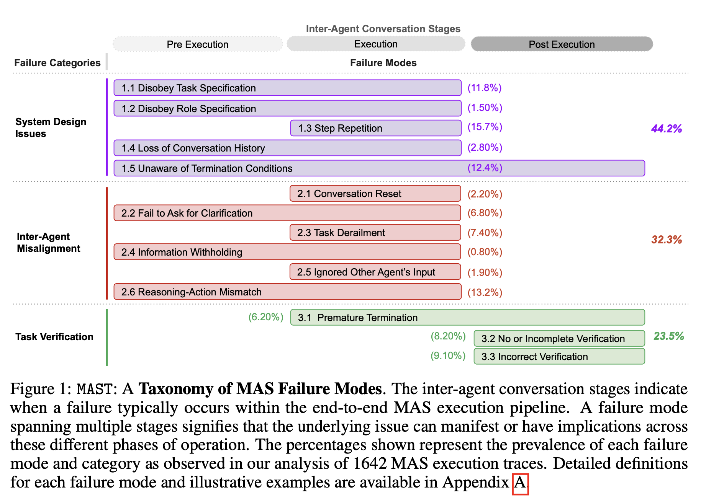
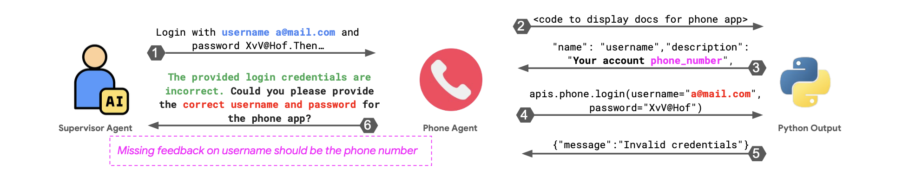

:::{.callout-note}
- Article: [*Why Do Multi-Agent LLM Systems Fail?*](https://arxiv.org/abs/2503.13657)
- Presenter: [Hongsup Shin](https://www.linkedin.com/in/hongsupshin/)
- Attendees: [Aaron Foote](https://www.linkedin.com/in/aaron-foote-ph-d-76b0803a/), [Chunshan Liu](https://www.linkedin.com/in/chunshan-liu-5b832b104/), [Meghann Agarwal](https://www.linkedin.com/in/meghann-agarwal/), [Nicholas Legendre](https://www.linkedin.com/in/nicholas-legendre/)
:::

## Why this paper

Agent reliability comes up often in our discussions, though we usually focus on whether systems work. This paper takes the opposite angle: it catalogs the ways multi-agent LLM systems (MAS) break down. We expected a structured account of failure modes to be educational in its own right, on the premise that understanding *how* these systems fail is a prerequisite for designing better ones.

Multi-agent architectures are increasingly promoted as a way to scale LLM capabilities, yet their gains over single-agent baselines are frequently modest. A taxonomy of failures grounded in real execution traces offers a vocabulary for diagnosing where, and why, the added complexity does not pay off.

## Paper summary

The paper introduces MAST, the Multi-Agent System Failure Taxonomy, together with MAST-Data, a dataset of over a thousand annotated execution traces drawn from seven popular MAS frameworks across coding, math, and general-agent tasks. The authors build the taxonomy bottom-up using Grounded Theory: six human experts closely read an initial set of 150 traces (each running to many thousands of lines) and let the failure categories emerge from the data itself. The result is 14 fine-grained failure modes grouped into three categories (system design issues, inter-agent misalignment, and task verification), with definitions refined across inter-annotator agreement rounds until annotators reached high consensus (Cohen's κ = 0.88). To scale annotation beyond what humans could label by hand, they calibrate an LLM-as-a-judge (OpenAI's o1) against the human labels and apply it to the full dataset.



Across the seven systems, the authors report failure rates ranging from roughly 40% to nearly 90%, and the three categories appear in roughly balanced proportions, with no single cause dominating. Their central claim is that these failures stem largely from how the systems are designed and coordinated: poorly specified roles, breakdowns in inter-agent communication, and inadequate verification. The weakness of the underlying model is only part of the story. To support this, they run intervention case studies on ChatDev and AG2, showing that targeted changes, such as clarifying role specifications, enforcing hierarchy, or adding a high-level verification step, raise task success without changing the base model (for example, reported gains of roughly 9% and 16% on ChatDev).

From these results the authors argue that improvements in base models alone will not resolve MAS failures, drawing an analogy to high-reliability human organizations: even capable individuals fail when the organizational structure is flawed. They position MAST as both a descriptive taxonomy and a practical debugging tool, released as a pip-installable library, that lets developers profile which failure modes dominate a given system and check whether an intervention actually reduces them.

## Discussion

We found this an unusually careful paper. Failure analysis is underrepresented in the MAS literature, and the authors approach it with real methodological discipline: Grounded Theory is an appropriate choice for building a taxonomy without a predefined hypothesis, the inter-annotator agreement studies are a genuine effort at reproducibility, and releasing the dataset, taxonomy, and annotator pipeline lowers the barrier for others to build on the work. The taxonomy is also immediately useful as shared vocabulary: having precise names for modes such as "disobey role specification" or "incorrect verification" makes it easier to say what went wrong in a system. Most of our discussion, accordingly, concerned the scope of its central question.

### What counts as a "truly" multi-agent failure?

The bulk of our conversation concerned the title itself: what makes a failure *multi-agent*? The paper's definitions are broad. An agent is essentially any LLM call with a system prompt and tools, and a MAS is any collection of such agents interacting through orchestration, a definition that admits both genuinely multi-agent systems and what are really multi-step single-agent pipelines. Under that umbrella, many of the 14 modes describe pathologies a lone agent exhibits just as readily. Step repetition, premature termination, task derailment, and incorrect verification all occur in single-agent settings; placing them inside a MAS does not make them multi-agent failures.

When we stress-tested the taxonomy against this distinction, only a small fraction of the modes appear *irreducible*: failures that cannot occur in a single agent given the same task, tools, and information. By the paper's own prevalence numbers, the two modes whose definitions explicitly require another agent (information withholding and ignoring another agent's input) account for under 3% of observed failures; a generous reading that also counts the instance-dependent "mixed" modes still lands below roughly 18%. The large majority of what MAST catalogs is, in effect, single-agent failure observed inside a multi-agent costume.



We attribute this to the sampling frame itself. MAST was built from cooperative, mostly sequential, hierarchical frameworks on coding and math benchmarks. Those architectures rarely exhibit true concurrency, include no adversarial agents, and impose no privacy partitions, so failures unique to such settings could not surface. Several classes that strike us as genuinely irreducible are absent from the taxonomy entirely:

- **Deadlock under shared resources.** Two or more agents wait on each other in a circular chain, each holding a resource the next needs, and the system freezes. A single agent holding its own resource never waits on itself. Recent work operationalizes the classic dining-philosophers setup with LLM agents and measures deadlock rates from 25% to 90%, finding that the coordination protocol drives the outcome far more than the model's capability ([Hasan & BusiReddyGari, 2026](https://arxiv.org/abs/2602.13255)).
- **Mandatory information partitions.** One agent holds data another is contractually barred from seeing, and the task is to collaborate while keeping that partition intact, so it cannot be reduced to handing a single super-agent all the information. A dedicated benchmark for this setting finds leading models leak a large share of sensitive information even when explicitly told not to ([Juneja et al., 2025](https://arxiv.org/abs/2510.15186)).
- **Adversarial agents with opposed objectives.** When agents have genuinely conflicting incentives (buyer versus seller, or competitors), they can collude against the principal or exploit one another, behavior a single optimizer cannot exhibit against itself. LLM pricing agents have been shown to autonomously reach supracompetitive, collusive prices in simulated markets ([Fish et al., 2024](https://arxiv.org/abs/2404.00806)).
- **Information cascades and false consensus.** One agent states a confident but wrong claim, others build on it, and a third reads the apparent agreement as independent corroboration, so a guess locks in as "consensus." Manufacturing independent-looking confirmation takes more than one agent. LLM agents have been shown to abandon correct independent answers to conform to the group ([Weng et al., 2025](https://arxiv.org/abs/2501.13381)), and seeded errors can propagate through message dependencies into system-level false consensus ([Xie et al., 2026](https://arxiv.org/abs/2603.04474)).
- **Lossy decomposition and recomposition.** When an orchestrator splits a task across agents that communicate only through narrow language interfaces, decision-relevant information can be lost in the hand-offs and never recovered when the pieces are recombined. A recent analysis proves such delegated networks are dominated by a centralized decision-maker with the same information, and shows accuracy degrading as a task is relayed across more agents ([Ao et al., 2026](https://arxiv.org/abs/2603.26993)).

These are not exotic: they are the failures that appear precisely *because* a system is more than one agent. The scenarios above are illustrative, but the underlying mechanisms are documented in a separate strand of literature, one that a taxonomy built on cooperative coding and math pipelines is structurally unable to surface.

### Evaluating multi-agent systems

A related question was how one should evaluate a MAS in the first place, and here we were sympathetic to the difficulty. Unlike traditional software, MAS failures rarely have a single identifiable root cause, and ground truth for *why* a run failed is hard to establish. The paper's own answer, an LLM-as-a-judge calibrated against human labels, is pragmatic, and the reported agreement (κ = 0.77) is reasonable, though it inherits weaknesses we note below. The paper is not alone in tackling this. Complementary efforts frame evaluation as failure *attribution* (the [Who&When](https://arxiv.org/abs/2505.00212) dataset asks which agent erred and at which step), as automatically derived multi-dimensional criteria ([AgentEval](https://arxiv.org/abs/2405.02178)), or as interactive debugging ([AGDebugger](https://arxiv.org/abs/2503.02068) lets developers replay and edit agent message histories). We came away thinking that failure-mode taxonomies like MAST and attribution-style tooling are complementary: robust MAS evaluation will likely need both a shared vocabulary and trace-level attribution, and neither alone is sufficient.

### The missing "why"

Our main substantive critique is that the paper is strong on *what* fails but thin on *why*. The taxonomy and prevalence statistics are descriptive, and the explanatory passages, particularly the later sections arguing that design matters more than model capability, read as plausible but largely speculative, with mechanisms asserted but not demonstrated. The appeal to a collapse of "theory of mind" for inter-agent misalignment, for instance, is evocative but untested. We saw this as a missed opportunity: understanding the mechanism behind a failure is what points to a remedy. Knowing that incorrect verification is common is useful; knowing *why* verifiers settle for superficial checks (a capability ceiling, shallow compliance with the literal prompt, or missing grounding and tools) is what tells you how to fix it. Without that causal account, the proposed interventions remain tactical, and the paper's own results reflect this: the fixes help but leave overall task-completion rates low.

### When is a multi-agent system worth it?

This led to a broader debate about when a multi-agent design earns its keep, and two schools of thought surfaced. One holds that hand-built agent scaffolds are a liability: the next model generation tends to obsolete them, and the brittleness and maintenance cost outweigh the benefit. The other holds that reliability, observability, cost control, and compound-error management need explicit structure no matter how capable the model becomes. The paper sits firmly in the second camp, and its organizational analogy is the strongest statement of that view.

The evidence we know of suggests the answer depends on the task. For deep, sequential, multi-hop reasoning, a single capable agent with a large thinking budget often matches or beats a multi-agent pipeline under the same token budget ([single-agent vs. multi-agent on multi-hop reasoning](https://arxiv.org/abs/2604.02460)), and the orchestration mostly adds the coordination failures MAST catalogs. For breadth, where a task fans out into many independent subtasks that each need their own context, multi-agent designs pay off through parallel compute and aggregated context. Anthropic's 2025 account of its research system is a clear example of the breadth case: a lead agent spawns parallel subagents for wide, source-heavy search, at a large token cost ([Anthropic, 2025](https://www.anthropic.com/engineering/built-multi-agent-research-system)).

Seen this way, the paper's framing is slightly off-target. Many of the failures it documents are the price of using multi-agent structure where a single agent would do, so the first question is whether the orchestration was warranted at all, before asking how to harden it.

### Methodological caveats

A few smaller concerns came up around the empirical scaffolding. The inter-annotator agreement, while welcome, is measured on a small sample (15 traces, three annotators) and on the same traces used to refine the taxonomy definitions, which tends to inflate it: after tuning definitions toward consensus, a high κ is close to guaranteed. A single aggregate κ can also mask disagreement on individual modes, and it cannot detect a *missing* category, which matters here precisely because we are not confident the Grounded Theory pass covered the full failure space. We also noted a latent same-family bias: in several configurations the traces and the LLM judge come from related model families, and the paper does not compare alternative judges (for example o1-mini or a Claude model) to rule out affinity effects. None of this undermines the contribution, but it argues for treating the precise percentages as indicative only.

### Final thoughts

Overall, this is a careful and rigorously built piece of work, and the pedigree shows. It comes out of Berkeley's Sky Computing group, which has a long track record of durable systems infrastructure such as Ray and Spark, and that engineering sensibility is visible in how MAST-Data and the annotation pipeline are constructed and released. The taxonomy gives the field a shared vocabulary it lacked, and the dataset is a genuine contribution.

Our two reservations are the ones above. The methodology has real caveats, and the central framing is the weakest part: by the paper's own numbers, most of the catalogued modes are single-agent pathologies, and the failures unique to multi-agent systems lie outside the sample it drew from. We would treat MAST as a useful map of where cooperative LLM pipelines break, while remembering that the genuinely multi-agent failure space is still mostly uncharted.

---

*If you found this post useful, you can cite it as:*

```bibtex
@article{
    austinmljc-2026-multi-agent-failures,
    author = {Hongsup Shin},
    title = {Why Do Multi-Agent LLM Systems Fail?},
    year = {2026},
    month = {06},
    day = {25},
    howpublished = {\url{https://austinmljournalclub.github.io}},
    journal = {Austin ML Journal Club},
    url = {https://austinmljournalclub.github.io/posts/202606-multi-agent-failures/},
}
```
