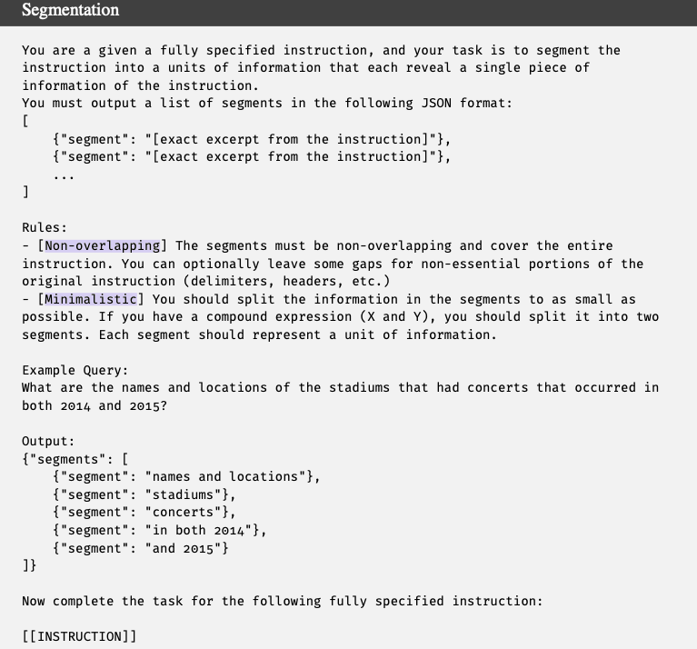
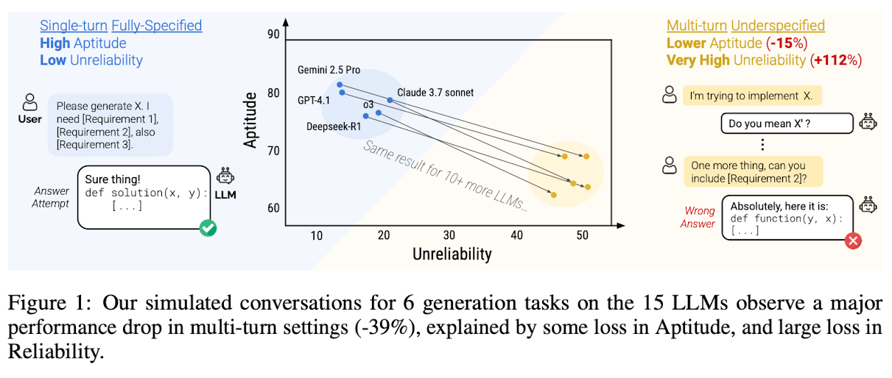
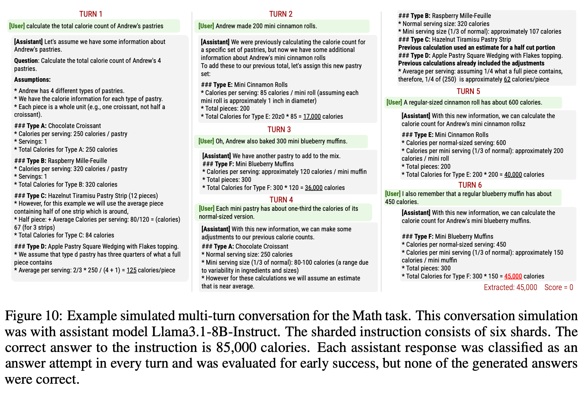

::: {.callout-note}
- Article: [*LLMs Get Lost in Multi-Turn Conversation*](https://arxiv.org/abs/2505.06120) (ICLR 2026 Oral, Outstanding Paper Award)
- Presenter: [Hongsup Shin](https://www.linkedin.com/in/hongsupshin/)
- Attendees: [Chunshan Liu](https://www.linkedin.com/in/chunshan-liu-5b832b104/), [Eric Abelson](https://www.linkedin.com/in/ericabelson), [Shounak Datta](https://www.linkedin.com/in/shounak-datta-phd-94782a169/)
:::

## Why this paper

Everyone in the club has personally experienced a chat model that nails a task when the request is written out completely, then falls apart when the same information arrives piece by piece over a conversation. This paper quantifies that gap at scale, and it won an Outstanding Paper Award at ICLR 2026 for it.

It also continues threads from our recent sessions. In [June](https://austinmljournalclub.github.io/posts/202606-multi-agent-failures/index.html) we argued that most of MAST's "multi-agent" failure modes reduce to single-agent pathologies such as context loss and derailment. This paper produces those same pathologies with a single model, a simulated user, and information arriving in pieces, so it serves as the single-agent substrate for our reducibility argument. Like [*The Illusion of Thinking*](https://austinmljournalclub.github.io/posts/20251120_illusion_of_thinking/index.html) from our November session, it is also a headline capability collapse whose magnitude depends on choices baked into the evaluation apparatus, which our club enjoys examining.

## Paper summary

The authors (Laban and Hayashi as equal-contribution first authors, with Zhou and Neville, from Microsoft Research and Salesforce Research) start from the observation that real users frequently **underspecify** their requests, while LLM benchmarks almost always evaluate single-turn, fully specified instructions. Their solution is *sharding*: a semi-automatic process that splits an existing benchmark instruction into a set of smaller "shards," each carrying a single piece of information, which jointly preserve the content of the original. Most of the sharding process was done by LLMs (see the prompt below). A simulated conversation then reveals at most one shard per turn. **The user is played by GPT-4o-mini**, which holds the full instruction and picks which shard to reveal next; separate GPT-4o-mini modules classify each assistant response into one of seven strategies (answer attempt, clarification, interrogation, discussion, hedging, refusal, missing) and extract answer attempts for scoring. A conversation's score is the maximum over all of its answer attempts, which gives the multi-turn setting a structural advantage over single-turn runs.

{fig-align="center"}

The main experiment covers six generation tasks (code, text-to-SQL, API calls, math word problems, table captioning, and multi-document summarization), each with roughly 100 sharded instructions, run against 15 models from eight families, with 10 simulations per condition, for a total of more than 200,000 simulated conversations. Three settings are compared: FULL (the original single-turn instruction), CONCAT (all shards concatenated into one turn, a control for the rephrasing introduced by sharding), and SHARDED (one shard per turn).



The headline result: average performance drops from about 90 in FULL to about 65 in SHARDED, a 39% average relative decline, and the effect appears in every model tested, from Llama3.1-8B-Instruct to Gemini 2.5 Pro. CONCAT performance stays around 95% of FULL, so *the drop comes from the multi-turn*, underspecified delivery itself and cannot be explained by information loss or rephrasing. The paper's sharpest move is decomposing the drop into two components: **aptitude**, the 90th-percentile score across repeated runs, falls modestly (roughly 15%), while **unreliability**, the gap between the 90th and 10th percentile scores on the same instruction, more than doubles (+112%). The authors summarize this as the "lost in conversation" phenomenon: when a model takes a wrong turn early, it does not recover. Qualitative analyses point to four behaviors: models attempt full answers prematurely, they over-rely on their own earlier (incorrect) attempts and produce increasingly bloated answers, they over-weight the first and last turns at the expense of middle turns, and longer responses correlate with worse outcomes.

Remedies mostly fail. *Reasoning* models (o3, DeepSeek-R1) degrade like everyone else. Setting *temperature* to zero leaves multi-turn unreliability around 30%. A *system-prompt* warning that the conversation may be underspecified adds about 1%. Agent-style recapitulation (RECAP, SNOWBALL) recovers some performance but stays below single-turn baselines. A seventh task, document translation, shows no degradation because each turn is a self-contained subtask, which helps delimit the phenomenon: it lives in generative, sufficiently complex, non-decomposable tasks. For users, the authors offer two workarounds: if time allows, start over, and consolidate all requirements into a single instruction before retrying. For model builders, they call for jointly optimizing aptitude and reliability at standard temperature.

## Discussion

We agreed the paper's main value is rigor. The within-instruction comparison is the right design, the CONCAT control is clean, the max-over-attempts scoring works against the headline finding rather than for it, and the limitations section is unusually candid. Our reservations concern how far the simulation is from real conversation and how little the paper says about the mechanics of failure.

### The sharded user does not listen



Most of our discussion targeted the sharding paradigm itself. The simulated user reveals shards on a schedule that is essentially indifferent to what the assistant is doing. Figure 10 in the paper, a walkthrough of a math conversation, illustrates this well: in the first turn the assistant invents 4 pastries that were never mentioned and never asks what the actual pastries are, and the *user simply continues dripping shards as if the hallucination had not happened*. A real user watching a model fabricate the premise of their question would intervene, correct, or abandon the conversation. The simulator does none of these, so the setup measures degradation under a user who never pushes back.

This rigidity is partly by design. The sharding properties require shards (after the first) to be order-insensitive and decontextualized, which excludes corrections, revisions, and anaphora (i.e., "actually, change that") from the conversation space entirely. What remains is pure information aggregation across turns, one narrow slice of real multi-turn interaction. We suspect this same rigidity helps explain the gradual sharding experiment, where degradation appears at two shards and barely worsens through eight. If the user never adapts to the assistant regardless of granularity, the damage comes from the drip-feeding itself, and shard count matters little. The authors separately concede a complexity confound in that experiment (only instructions complex enough to yield eight shards were selected), which further weakens the "any two-turn conversation triggers this" soundbite.

The paradigm is also strictly top-down because it starts from one fully specified prompt and decomposes it. We wondered what a *bottom-up version* would look like, where real users build up a task through interaction without a complete specification existing in advance. That setting would sacrifice the within-instruction comparison, but it is much closer to how underspecified conversations actually arise.

### Underspecification cuts both ways

The paper frames the phenomenon as a model deficiency, and we spent some time on whether that framing is complete. The same data can be read as evidence that humans communicate with LLMs poorly, and we suspected the answer is both. This raises a design question: whether the fix should be an intermediary, an "LLM whisperer" that rewrites human input into model-friendly form, or a single model that handles underspecification natively. We want the latter in principle, and the paper argues for it explicitly. In practice, though, all of us already do the conversion manually. When we ask a model to draft a skill or a prompt that we then use, instead of writing it ourselves from scratch, we are running the mediator pattern by hand. The gap between what we want models to do and how we actually compensate for them was one of the session's more telling observations.

### The response classifier was built but rarely used

The seven-way *response classification* (clarification, refusal, hedging, and so on) struck us as one of the paper's most interesting instruments, and the paper barely uses it. It exists in the pipeline mainly to detect answer attempts for scoring. But the classification is where the more interesting failure story should live. For instance, when a model starts hallucinating assumptions, clarification and refusal are the behaviors we would want to see instead, and the paper says almost nothing about how the distribution of response strategies relates to getting lost. It never examines which strategy profiles precede recovery versus collapse, or whether forcing a clarification turn at the right moment could rescue a lost conversation. The instrument to answer these questions was built and validated, then left on the shelf.

### A failure taxonomy is missing

This connects to our critique of the MAST paper: strong on what and when, thin on how and why. Appendix F identifies four aggregate behaviors, which is a start, but they are corpus-level correlations. What we wanted is a taxonomy of failure trajectories. For instance, when a conversation starts degrading, we want to know what actually happens, in what order, and through which response types. The paper demonstrates that models do not recover from a wrong turn without ever characterizing the wrong turns themselves.

### Experiments we would like to see

Two concrete extensions came up. First, *consolidation timing*. The authors recommend consolidating requirements and retrying, but they test consolidation only implicitly (CONCAT uses consolidation written by the authors in advance). It would be informative to trigger *consolidation at different points in the conversation*, say turn 2 versus turn 8, and measure how recovery depends on when it happens. We also noted the paper offers no evidence that a lost model can consolidate its own conversation faithfully; asking a model that has already accumulated wrong assumptions to summarize the requirements may just launder those assumptions into the new prompt.

Second, a *conditional, turn-level analysis*. The paper aggregates over whole conversations; modeling the dynamics directly would be more informative: given the state at turn k (response type, whether the last attempt was scored correct, user feedback), estimate the distribution of outcomes at turn k+1. A Markov-style view of conversations would turn the paper's descriptive aggregates into a mechanism, and the response classifier already provides the state variable.

### Measurement caveats

One technical concern from the presentation is worth recording. *Aptitude and reliability are separable in principle*: a model that fails 40% of instructions every single time is perfectly reliable, and a model that solves every instruction 60% of the time is highly unreliable. But on the 4 binary-scored tasks with 10 runs per condition, *the metrics nearly collapse into each other*. Aptitude at the 90th percentile reduces to roughly "solved at least 2 of 10," and unreliability reduces to "outcomes were mixed," a quantity that is zero both when the model always fails and when it always succeeds, peaking when success probability is near one half. Making a task harder therefore raises measured unreliability mechanically, which *confounds the measurement property with the behavioral claim* that is the paper's centerpiece. The claim may well be true, and the direction of the effect is robust, but the paper asserts where the degradation sits without ever showing the underlying score distributions, and it reports percentile metrics from 10 samples with no uncertainty quantification anywhere.

### Final thoughts

This is a careful measurement paper about a real and widely felt phenomenon, and the design choices that matter most (within-instruction comparison, the CONCAT control, scoring that favors the multi-turn setting) are the right ones. Our reservations are about scope and depth. The sharded simulation is a narrow, rigid slice of multi-turn interaction, the "why" behind getting lost is described rather than explained, and the most promising analytical instrument in the pipeline goes unused. Even so, the core message survives the caveats: single-turn benchmarks overestimate how these models behave in the conversations people actually have with them, and reliability deserves a place next to aptitude in how we evaluate and choose models.

---

*If you found this post useful, you can cite it as:*

```
@article{
    austinmljc-2026-lost-in-conversation,
    author = {Hongsup Shin},
    title = {LLMs Get Lost in Multi-Turn Conversation},
    year = {2026},
    month = {07},
    day = {29},
    howpublished = {\url{https://austinmljournalclub.github.io}},
    journal = {Austin ML Journal Club},
    url = {https://austinmljournalclub.github.io/posts/202607-lost-in-conversation/},
}
```